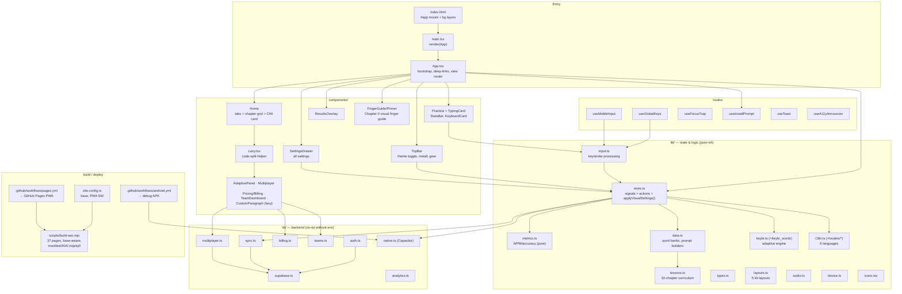

# PROJECT MAP

The maintained app lives in `app/` (Preact + TS + Vite). The repo root also
contains a legacy vanilla-JS prototype (kept for reference, not built/shipped).

## Architecture (app/src)

## Key flows

- **Settings → live repaint:** any control → `updateSetting()` (store) → updates
  `settings` signal + persists → a reactive `effect()` calls
  `applyVisualSettings()` → writes body classes + CSS vars. (This is the path
  that was broken and is now fixed + tested.)
- **Typing:** `useGlobalKeys`/`useMobileInput` → `input.ts processInput()` →
  store updates `pos/errorIdx/...` → `metrics.ts` computes WPM/acc (computed
  signal) → `completeSession()` writes history + optional cloud push.
- **Deep links:** SEO pages link `/?lesson=ID` / `?mode=adaptive` → `App.tsx`
  reads query params on mount and pre-picks the mode.
- **Base path:** root `/` for dev/custom-domain/native; `/typing-master-scorp/`
  for GitHub Pages (via `build:pages`). `build-seo.mjs` derives BASE from Vite's
  built index.html so SEO pages always match the bundle.

## Backend gating

Every backend module exports an `isXConfigured()` and no-ops without env vars,
so the app runs fully local-only out of the box. Env vars documented in
`app/.env.example` + the `*_SETUP.md` files.
