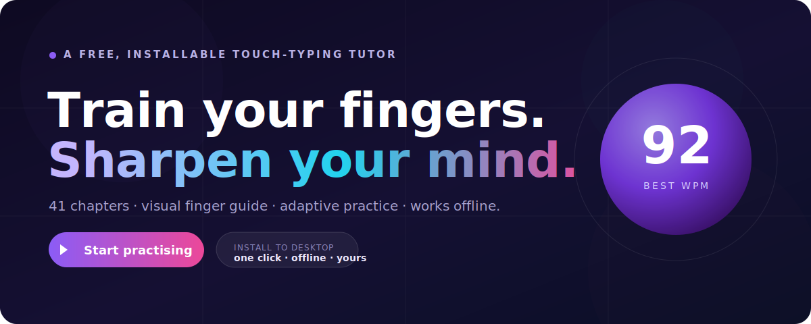

<div align="center">

<a href="https://dilip-kumar-22.github.io/typing-master-scorp/">
  
</a>

# ⌨️ Typing Master

### Learn to touch-type properly — a free, installable typing tutor that lives on your desktop and works offline.

[**▶️ Open the app**](https://dilip-kumar-22.github.io/typing-master-scorp/) &nbsp;•&nbsp; [Install guide](#-install-it-on-your-laptop-1-minute) &nbsp;•&nbsp; [Features](#-what-you-get) &nbsp;•&nbsp; [For developers](#-for-developers)


</div>

---

Typing Master teaches touch typing the way it actually sticks: **one finger, one key, built into muscle memory** — starting from a visual "which finger goes where" primer and climbing through a **41-chapter curriculum** (Chapter 0 → Chapter 40). It's a **Progressive Web App**, so you install it straight from the browser, pin it to your desktop, and it keeps working with **no internet** — with every lesson, stat, and setting saved **on your own device**.

No account. No ads. No tracking by default. Free forever.

---

## 🚀 Install it on your laptop (1 minute)

You don't download a sketchy `.exe` — you install it **from the browser**, and it behaves like a real desktop app (its own window and icon, offline support, auto-updates).

### 💻 Windows / Mac / Linux — Chrome, Edge, or Brave
1. Open **[the app](https://dilip-kumar-22.github.io/typing-master-scorp/)**.
2. In the address bar (right side) click the **install icon** ( ⊕ / a little monitor ), **or** use the **Install** button in the app's top bar.
3. Click **Install** → it opens in its own window and adds a **desktop + Start-menu shortcut**.

> **Safari (Mac):** File → **Add to Dock**.

### 📱 Phone / tablet
- **Android (Chrome):** ⋮ menu → **Install app**.
- **iPhone/iPad (Safari):** Share → **Add to Home Screen**.

👉 Full step-by-step with screenshots: **[INSTALL.md](INSTALL.md)**

Once installed it runs completely offline, and **all your progress, stats, streaks, themes and settings are stored locally on your device** — nothing leaves your machine.

---

## ✨ What you get

| | |
|---|---|
| 🖐️ **Chapter 0 — visual primer** | A colour-coded keyboard shows which finger presses each key, with an animated hand guide. Learn the map before you type. |
| 📚 **41 chapters** | Home row → top/bottom rows → capitals → numbers → symbols → real-world fluency. Each with a guided tutorial. |
| 🎯 **Adaptive mode** | keybr-style: letters unlock as you hit your target speed; practice is weighted toward your weakest keys. |
| ⌨️ **3D keyboard heatmap** | See in real time which keys you hit most — and which you miss. |
| 🏁 **Challenges** | Daily seeded run, paragraph speed-runs, punctuation drills, and code-typing tests. |
| 📊 **Stats & trends** | Best/avg WPM, accuracy, streaks, session history, and a WPM-over-time trend graph. |
| 🔬 **Typing analysis** | A personal insights dashboard: all-time weakest keys, per-finger accuracy, improvement delta, consistency, and a plain-English "what to work on next" — with a one-click drill of your weak keys. |
| 🔥 **Streaks & achievements** | A daily practice streak and 10 unlockable badges (First Steps → Marathoner) to keep you coming back. |
| 💾 **Own your data** | One-click **export** of everything to a JSON file, and **import** to restore it on any device — a no-account way to back up and move your progress. |
| 🎨 **Make it yours** | Light/dark/auto themes, 4 accent colours, fonts, cursor styles, sound packs — all apply live. |
| 🌍 **6 languages · 5 layouts** | English, Spanish, Portuguese, Hindi, French, German · QWERTY/AZERTY/QWERTZ/Dvorak/Colemak. |
| 📴 **Offline-first PWA** | Installs to your device; works with no internet; updates itself when you're back online (with a friendly refresh prompt). |

> A backend (accounts, cloud sync, leaderboards, multiplayer, classrooms) is **built-in but optional** — the app runs fully local-only with zero setup. See [docs/](docs/) if you ever want to enable it.

---

## 🖼️ See it in action

The best demo is the real thing — **[open the live app](https://dilip-kumar-22.github.io/typing-master-scorp/)** (loads instantly, works offline once installed). A quick tour of what you'll find:

- **Chapter 0** — a colour-coded keyboard that shows which finger owns each key, with an animated hand guide.
- **Practice** — a 3D mechanical keyboard that lights up as you type, with live WPM and accuracy.
- **Your typing analysis** — weakest keys, per-finger accuracy, a practice streak, and unlockable achievements.

---

## 🛠️ Tech stack

**Preact + TypeScript + Vite** · `@preact/signals` state · `vite-plugin-pwa` (offline + install) · Capacitor (optional native shells). Everything is client-side and static — it deploys to any static host.

Optional, and off by default: Supabase (auth/sync/multiplayer/teams), Stripe (billing), PostHog (analytics). Each degrades gracefully to local-only when its env vars aren't set.

---

## 👩‍💻 For developers

```bash
git clone https://github.com/Dilip-kumar-22/typing-master-scorp.git
cd typing-master-scorp/app
npm install

npm run dev          # http://localhost:5173
npm test             # vitest → 137 passing
npm run typecheck    # tsc, clean
npm run build        # tsc + vite + 45 static SEO pages + PWA service worker (0 warnings)
npm run preview      # serve the production build
```

**Deploy:** pushing to `main` auto-builds and publishes to GitHub Pages via [`.github/workflows/pages.yml`](.github/workflows/pages.yml). It builds with `npm run build:pages` (adds the `/typing-master-scorp/` base path, patches the manifest, writes a `404.html` SPA fallback + `.nojekyll`).

To host it yourself anywhere else, `npm run build` and serve the `app/dist/` folder as static files.

---

## 📁 Repository layout

```
.
├── app/                      # the application (Preact + TS + Vite)
│   ├── src/
│   │   ├── components/       # UI (Home, Practice, SettingsDrawer, FingerGuide/Chapter 0, …)
│   │   ├── lib/              # store, metrics, keybr engine, lessons, i18n, device, …
│   │   ├── hooks/            # global keys, mobile input, focus trap, toast, install prompt
│   │   └── test/             # 137 vitest tests
│   ├── scripts/              # build-seo.mjs (static landing pages, base-aware)
│   └── supabase/             # OPTIONAL backend schema + edge functions (off by default)
├── .github/workflows/        # pages.yml (deploy PWA) · android.yml (build APK)
├── docs/                     # setup + build guides + media (README hero)
├── INSTALL.md  SECURITY.md  PROJECT_MAP.md  WORKLOG.md  LICENSE
└── README.md
```

## 📚 Documentation

| Doc | What |
|---|---|
| [INSTALL.md](INSTALL.md) | How anyone installs the app (desktop / Android / iOS) |
| [PROJECT_MAP.md](PROJECT_MAP.md) | Architecture diagram + file map |
| [SECURITY.md](SECURITY.md) | Security posture + responsible disclosure |
| [docs/BUILD_APPS.md](docs/BUILD_APPS.md) | Building the Android APK / iOS / desktop |
| [docs/SUPABASE_SETUP.md](docs/SUPABASE_SETUP.md) · [docs/STRIPE_SETUP.md](docs/STRIPE_SETUP.md) · [docs/TEAMS_SETUP.md](docs/TEAMS_SETUP.md) | Enabling the optional backend |
| [docs/MOBILE_PWA.md](docs/MOBILE_PWA.md) · [docs/NATIVE.md](docs/NATIVE.md) | PWA + native notes |

---

## 📄 License

[MIT](LICENSE) © Dilip Kumar. Free to use, learn from, and build on.

<div align="center"><sub>Built with care. If it helped you type faster, ⭐ the repo.</sub></div>
